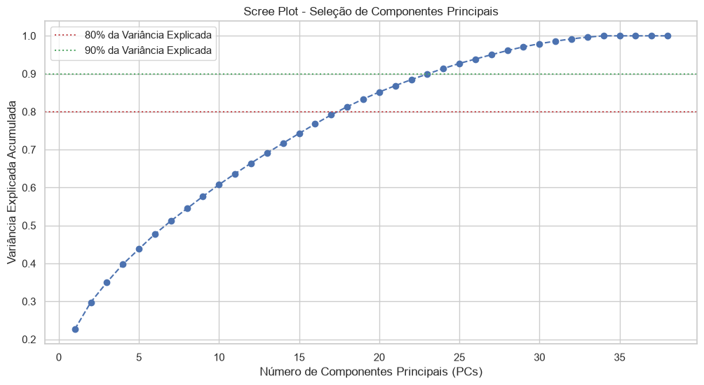

# 📊 Segmentação de Clientes e Redução de Dimensionalidade (PCA + K-Means)

Este projeto aplica técnicas avançadas de Ciência de Dados e Aprendizado Não Supervisionado para resolver um desafio clássico de marketing e e-commerce: **segmentar uma base de clientes com alta dimensionalidade para personalizar estratégias de conversão e retenção.**

---

## 🎯 O Problema de Negócio

Uma empresa de e-commerce possui uma base de dados rica com 2.240 registros e dezenas de atributos demográficos, comportamentais e financeiros.

* **Desafio:** A quantidade excessiva de atributos gera alta correlação e ruído estatístico, dificultando o agrupamento claro de clientes.
* **Objetivo:** Aplicar **PCA (Principal Component Analysis)** para reduzir o espaço dimensional preservando a maior parte da variância dos dados, e utilizar o algoritmo **K-Means** para definir personas acionáveis de marketing.

---

## 🛠️ Tecnologias e Ferramentas Utilizadas

* **Linguagem:** Python
* **Ambiente:** Jupyter Notebook
* **Manipulação de Dados:** Pandas, NumPy
* **Visualização:** Matplotlib, Seaborn
* **Machine Learning & Estatística:** Scikit-Learn (`StandardScaler`, `PCA`, `KMeans`, `silhouette_score`)

---

## 🚀 Metodologia Executada

1. **Tratamento & Feature Engineering:**
   * Imputação de nulos (`Renda` ajustada pela mediana).
   * Remoção de atributos sem variância/identificadores (`ID`, `Z_CostContact`, `Z_Revenue`).
   * Tratamento de outliers em renda e idade.
   * Criação de novas variáveis de negócio: `Idade`, `Idade_conta`, `Total_Gastos`, `Total_Filhos` e `Total_Compras`.
   * Aplicação de **One-Hot Encoding** nas categóricas, totalizando 38 colunas numéricas.

2. **Padronização:**
   * Utilização do `StandardScaler` (Média = 0, Desvio Padrão = 1), garantindo a premissa matemática do PCA.

3. **Redução de Dimensionalidade (PCA):**
   * Análise do **Scree Plot** da variância explicada acumulada.
   * Seleção de **18 Componentes Principais (PCs)**, garantindo a preservação de **80% de toda a variância dos dados** e eliminando a multicolinearidade.



4. **Clustering & Modelagem (K-Means):**
   * Definição da quantidade ideal de grupos utilizando o **Método do Cotovelo (Elbow Method)** e o **Silhouette Score**.
   * Agrupamento em **K = 4 Clusters**, trazendo equilíbrio entre coesão estatística e viabilidade estratégica.


---

## 📈 Resultados & Personas Encontradas

A redução no espaço das componentes principais permitiu identificar 4 perfis bem definidos de consumidores:


| Cluster | Nome da Persona | Renda Média | Gasto Médio | Filhos | Ação Estratégica Recomendada |
|:---:|:---:|:---:|:---:|:---:|:---|
| **0** | **Massa Econômica** | R$ 35.019,27 | R$ 94,95 | 1,23 | Cupons de desconto, frete grátis e produtos de entrada. |
| **1** | **Alto Valor Consolidado** | R$ 73.160,66 | R$ 1.264,01 | 0,24 | E-mail marketing personalizado e lançamentos de marcas *premium*. |
| **2** | **Engajados Família** | R$ 57.124,74 | R$ 712,55 | 1,23 | Programas de cashback e ofertas em pacotes familiares. |
| **3** | **Champions VIP** | R$ 81.358,91 | R$ 1.635,31 | 0,17 | Atendimento exclusivo, acesso antecipado e clube de fidelidade fechado. |

---

## 📂 Como Executar este Projeto

```bash
# Clonar o repositório
git clone [https://github.com/taymarinho700/Segmentação-Cliente-PCA-KMeans.git](https://github.com/taymarinho700/Segmentação-Cliente-PCA-KMeans.git)

# Entrar na pasta do projeto
cd Segmentação-Cliente-PCA-KMeans

# Iniciar o Jupyter Notebook
jupyter notebook
